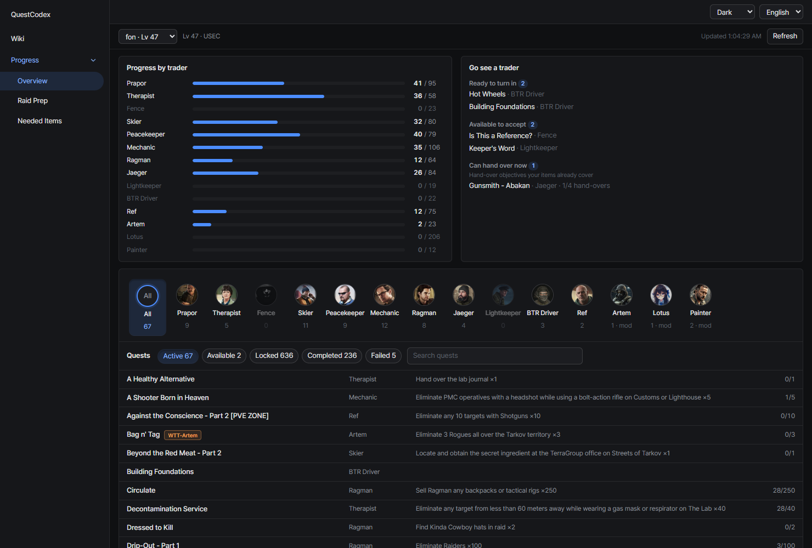
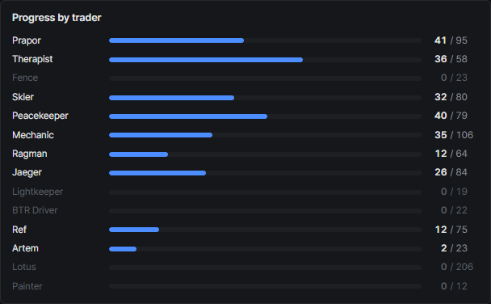
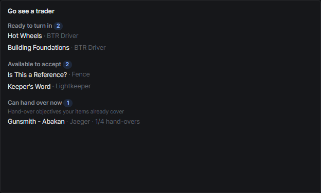
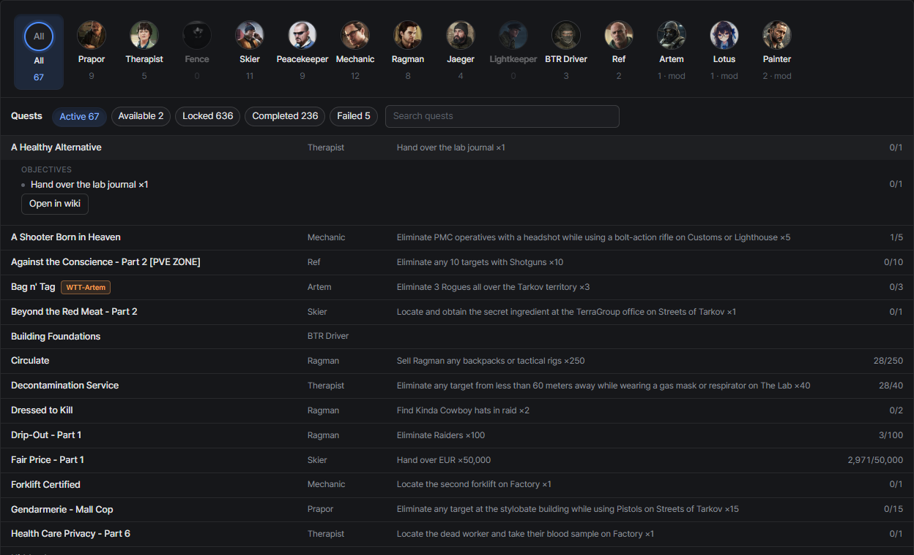

# Overview
{: .no_toc }

1. TOC
{:toc}

---

## Trader progress

A progress bar per trader with finished and total quest counts. Traders you've fully finished turn green.

## What you can do now

Under **Go see a trader**:

- **Ready to turn in**: every objective is done
- **Available to accept**: quests you can pick up now
- **Can hand over now**: hand-over objectives your items already cover

## Quests by status

All quests grouped by status, with search and the same trader row as the wiki. Click a quest to expand
its objectives and see which ones are done. Mod quests carry their mod name tag.

Quests you can never finish on this profile (other faction only, or a branch you already closed) are
marked **Unreachable**.

