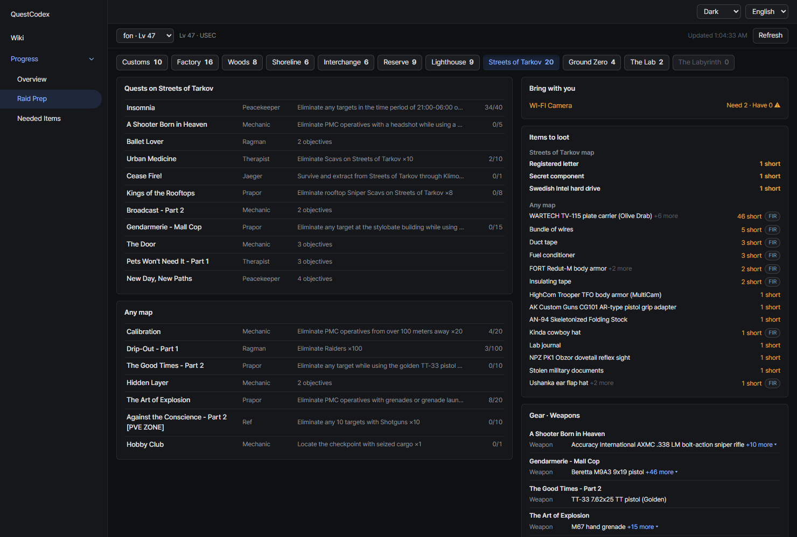
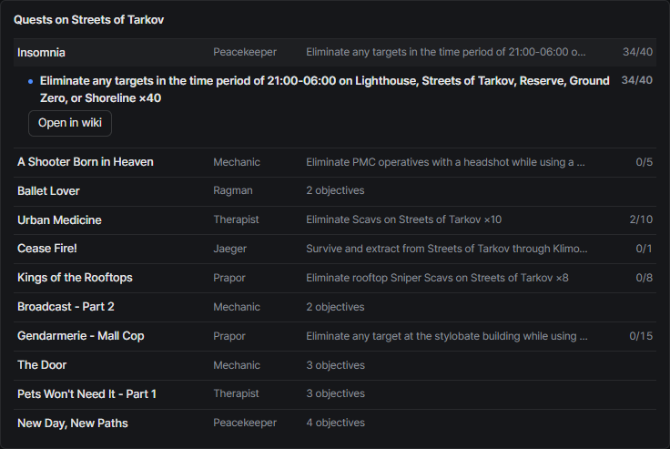
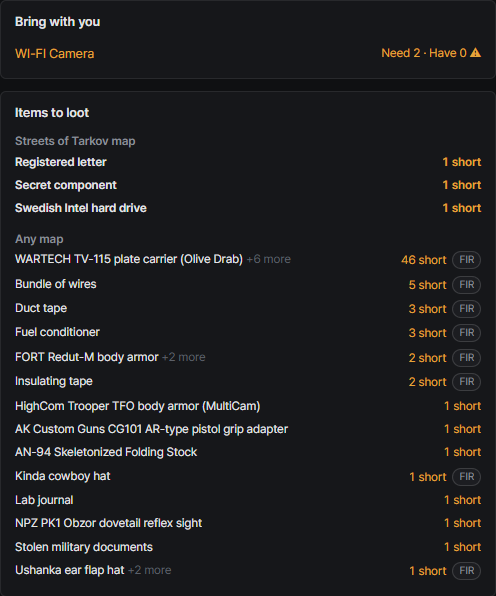
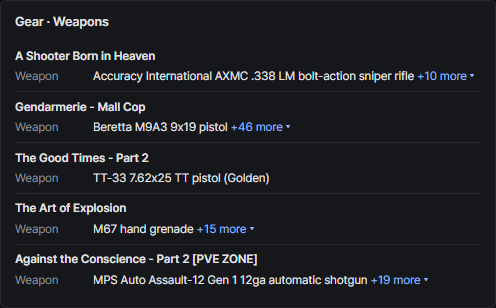

# Raid prep
{: .no_toc }

Pick the map you're about to play and see everything your active quests want there.

1. TOC
{:toc}

---

## Map tabs

Each map tab shows how many open objectives it has.

## Quests on this map

Quests with objectives on the selected map, plus objectives you can do on any map, grouped per quest.
Expanding a quest dims the objectives that belong to other maps.

## Bring with you / Items to loot

- **Bring with you**: items to plant on this map, with how many you need and how many you have
- **Items to loot**: items your quests want you to find on this map

## Gear and special conditions

- **Gear · Weapons**: required or banned gear and allowed weapons, grouped per quest
- **Special conditions**: rules like completing in a single raid or using a specific exit

{: .note }
Objectives without map data take the map named in their text, and are marked as inferred.
