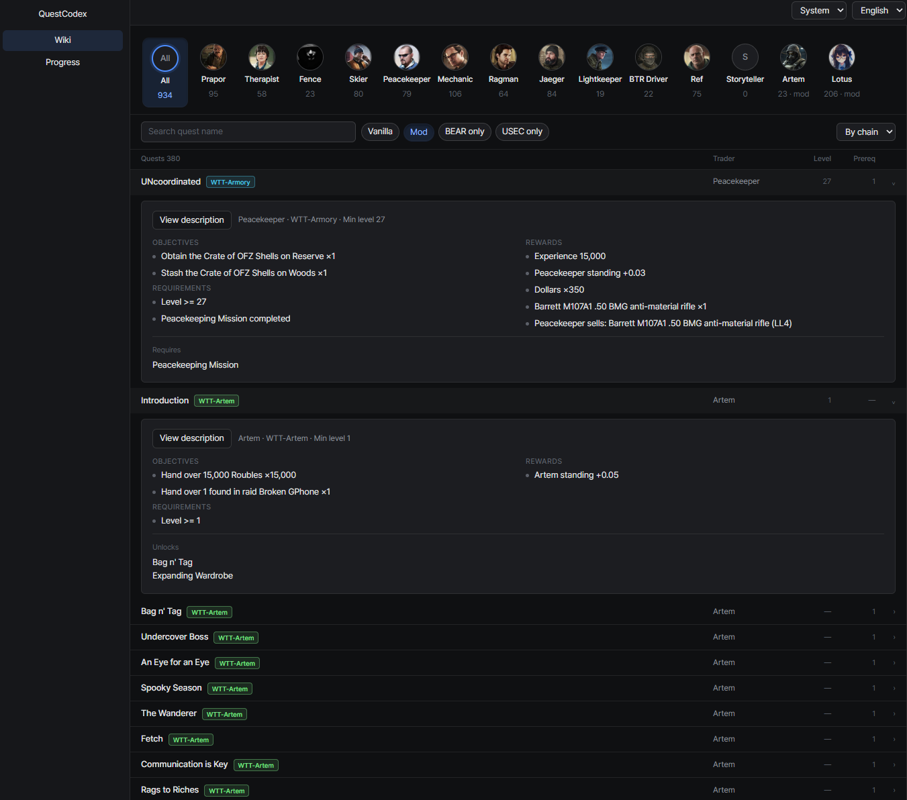
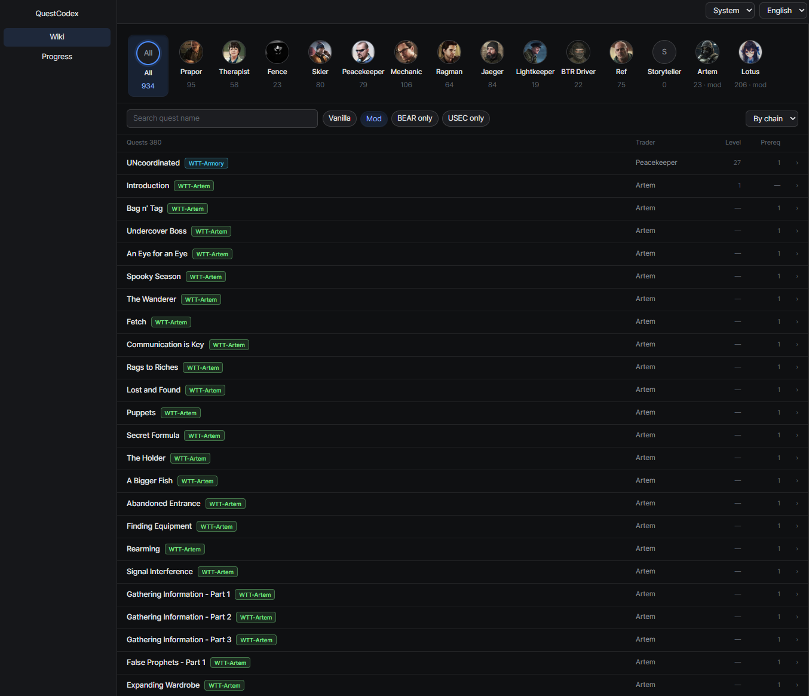

# Quest details
{: .no_toc }

1. TOC
{:toc}

---

## Inline expansion

Click a quest row and it expands in place with objectives, requirements, rewards (including on-accept and
on-fail rewards) and its prerequisite and unlock links. Several rows can stay open at once.

## Chain jumps

Click a prerequisite or unlocked quest name in the expanded row to jump straight to it.

## Description popup

The full quest description opens in a popup, so long text doesn't stretch the list.

## Branch warnings

Some quests sit on mutually exclusive branches: finishing one fails or locks the other.
These quests carry a branch tag in the list, and the details warn you which quests you would lock out.

<!-- screenshot: branch tag in the list and the warning box in quest details -->

## Mod attribution

Quests from mods carry their source mod's name, color-coded per mod.

{: .note }
Quests a mod injects from C# code rather than from JSON files leave no file trace, so their source mod
can't be identified. Those get a generic `mod` label instead.
