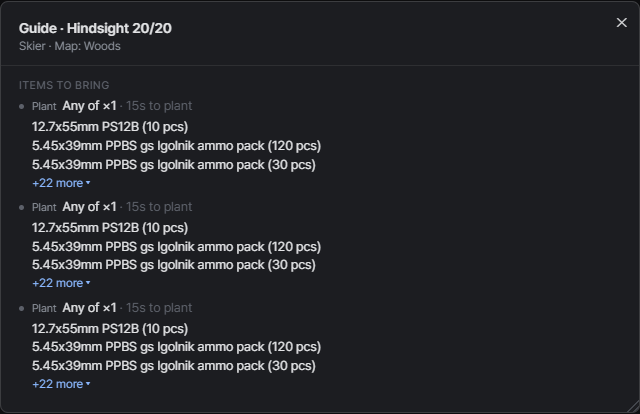
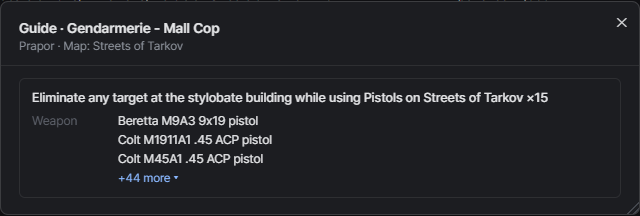

# Quest guide
{: .no_toc }

Hit the **Guide** button on a quest to see what to bring before a raid.

1. TOC
{:toc}

---

## What it shows

- The map the quest takes place on
- Allowed weapons, calibers and mods
- Required or banned gear
- Items to hand over or plant, with found-in-raid requirements
- Rules like finishing in a single raid or using specific exits

Mod items are included too.

Long lists collapse to the first few entries. Click **+N more** to see them all.

## Moving and resizing

- Drag the header to move the popup.
- Drag any edge to resize it.
- Your layout is remembered. Double-click the header to reset it.
