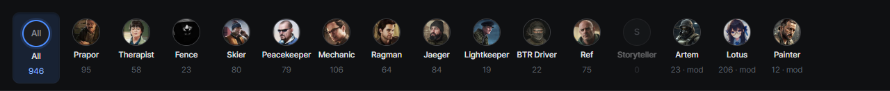
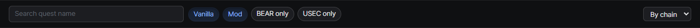

# Quest list
{: .no_toc }

1. TOC
{:toc}

---

## Trader filter

Pick a trader from the avatar row to see only their quests. Mod-added traders are listed too.

## Search and filter chips

Search by quest name, and narrow the list with the `Vanilla` / `Mod` and `BEAR only` / `USEC only` chips.

## Sorting

- **By chain** (default): prerequisites always sit above the quests they unlock
- **By level**
- **By name**

## Deep links

`?quest=<questId>` opens a specific quest directly, so you can bookmark or share a quest.
